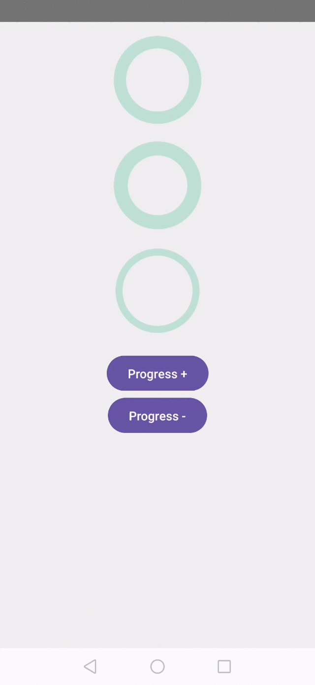

# Progress Circle for Android




### How to use (Compose)

```kotlin
ProgressCircle(
    modifier = Modifier.size(150.dp),
    progress = progress,
    progressCircleSpec = CircleSpec(
        color = Color.Green,
        width = 12.dp
    ),
    backgroundCircleSpec = CircleSpec(
        color = Color.Green.copy(alpha = 0.2f),
        width = 12.dp
    )
)

// or with animation

ProgressCircleAnimated(
    modifier = Modifier.size(150.dp),
    progress = progress,
    progressCircleSpec = CircleSpec(
        color = Color.Green,
        width = 12.dp
    ),
    backgroundCircleSpec = CircleSpec(
        color = Color.Green.copy(alpha = 0.2f),
        width = 12.dp
    ),
    animationSpec = tween(
        durationMillis = 500
    ),
    onAnimationFinished = { progress ->
        // React to animation completed event
    }
)
```

The animation itself is performed inside of the `ProgressCircleAnimated` Composable. You just need to pass the target value of `progress`.

### How to use (XML)
```xml
<de.bornholdtlee.progress_circle.view.ProgressCircleView
    android:id="@+id/progress_circle_view"
    android:layout_width="100dp"
    android:layout_height="100dp"
    app:pcv_colorBackground="@color/primaryVariant"
    app:pcv_colorProgress="@color/primary"
    app:pcv_progress="10"
    app:pcv_strokeWidthBackground="12"
    app:pcv_strokeWidthProgress="8" />
```
If you don't want to draw a background circle behind the progress indicator, just pass `@android:color/transparent` to the `app:pcv_colorBackground` paremter in your XML.

Set the progress:
```kotlin
binding.progressCircleView.progress = 20f
```

Set the progress with animation:
```kotlin

binding.progressCircleView.setProgressWithAnimation(progress = 20f)

// or fully specified

binding.progressCircleView.setProgressWithAnimation(
    progress = 20f,
    animationDuration = 2000L,
    animationInterpolator = OvershootInterpolator(1f)
) { newProgress ->
    // React to animation completed event
}
```

## Installation

Add it in your root build.gradle at the end of repositories:
```gradle
allprojects {
  repositories {
    ...
    maven { url 'https://jitpack.io' }
  }
}
```

Add the dependency to your module level build.gradle:
```gradle
dependencies {
  implementation 'com.github.bornholdtleegmbh:response-evaluator:1.2.1'
}
```
